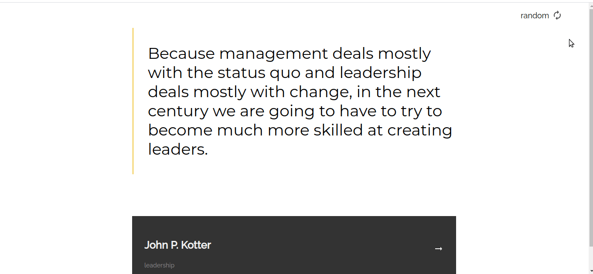

# Random Quote Generator

## ✍🏻 Description

This app was built with React and Typescript for the [Random Quote Generator challenge](https://devchallenges.io/challenges/8Y3J4ucAMQpSnYTwwWW8)


You can see the result here → [Site Alive](https://random-quote-generator-jb.netlify.app/)

## 🚀 Getting Started
The application is built with webpack. You can run the following command to install all dependencies.
```
$ npm install
```
Work in dev mode.
```
$ npm run start
```
Build final app.
```
$ npm run build
```

## 👩🏻‍💻 Technologies
1. React
2. RTL
3. Styled-components
5. Typescript

## 🎨 Preview
<details>
    <summary>🖥 Desktop version</summary>



</details>


